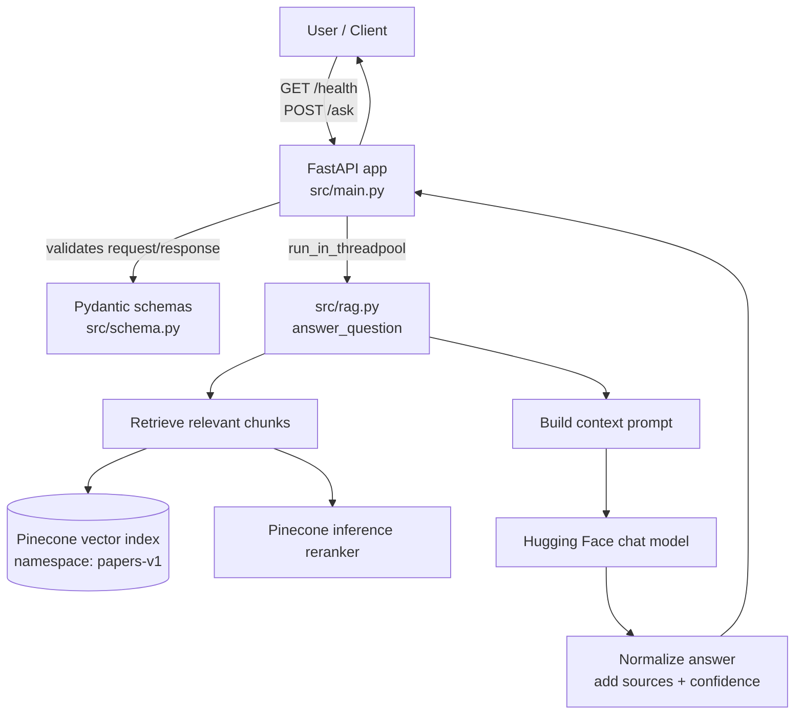
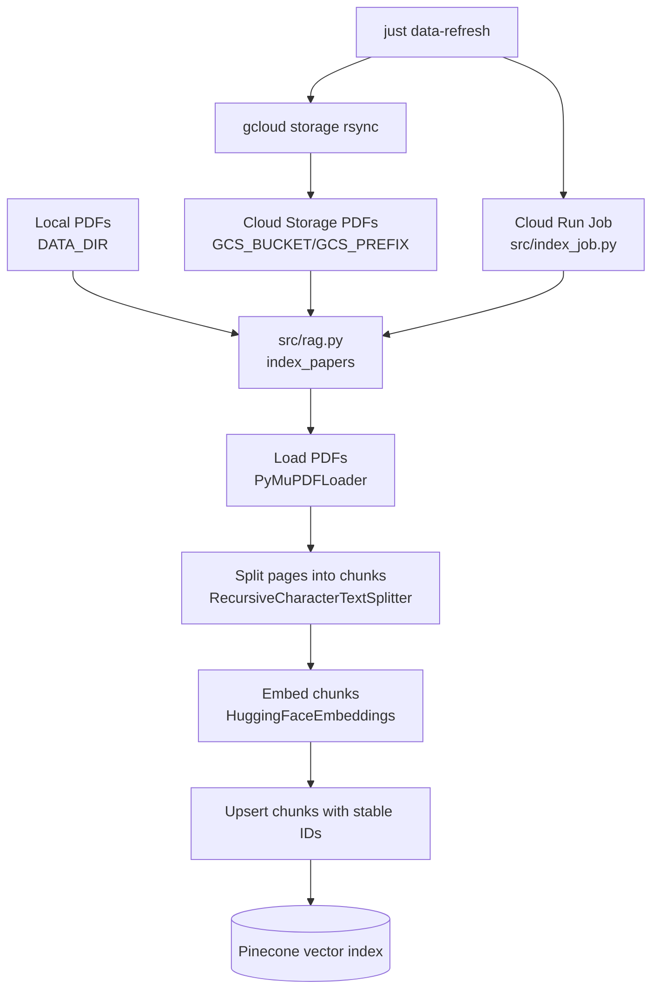
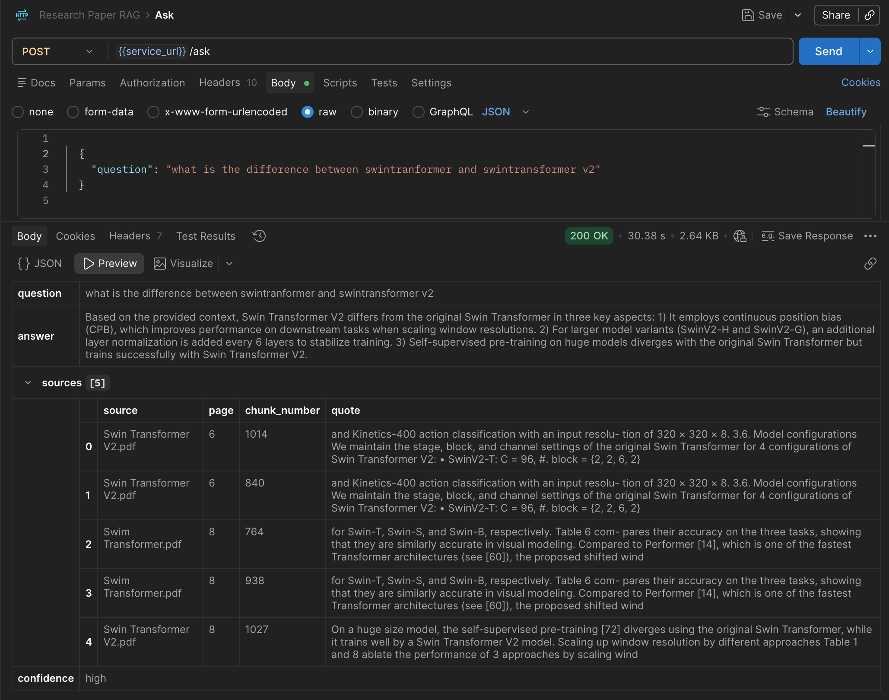

## Research Paper RAG API

The API has two main production steps:

1. Sync PDFs to Cloud Storage and index them into Pinecone.
2. Ask questions against the indexed paper chunks.

### Project Scope

This project implements an end-to-end production-style RAG application with:

- A **research paper RAG pipeline** that answers questions from indexed PDF
  content.
- **Pinecone vector search** for storing embedded paper chunks and retrieving
  semantically relevant context.
- **LangChain orchestration** for document loading, text splitting, prompting,
  embeddings, and vector-store access.
- **Hugging Face models** for embeddings and chat-based answer generation.
- A **FastAPI service layer** exposing `/health` and `/ask` endpoints.
- **Google Cloud Run deployment** for both the API service and indexing worker.
- **Google Cloud Storage** as the PDF data source for production indexing.
- **GitHub Actions workflows** for linting, security scanning, commit checks,
  ClickUp automation, and semantic releases.
- **ClickUp task automation** that updates task status from pull request
  activity.

### Technical Stack

| Area | Tools |
| --- | --- |
| Backend API | FastAPI, Pydantic |
| RAG pipeline | LangChain, Hugging Face |
| Vector database | Pinecone |
| Cloud platform | Google Cloud Run, Google Cloud Storage |
| DevOps | uv, Docker, GitHub Actions, semantic-release |
| Quality and automation | Ruff, Bandit, commitlint, ClickUp |

### Architecture

Question-answering flow:



Indexing flow:



### Setup

Create `.env` from the example and fill in your real values.

```bash
cp .env.example .env
```

One-time cloud storage setup:

```bash
just grant-secret-access
just setup-bucket
```

### Workflow

This repo uses `just` for the main local and cloud workflow.

List available commands:

```bash
just
```

When PDFs change, refresh the remote data first:

```bash
just data-refresh
```

`just data-refresh` expects the Cloud Run indexing job to exist. Run
`just deploy-production` after code or deployment configuration changes so both
the API service and indexing job are updated.

Then make code changes and test locally:

```bash
just deploy-local
just health
just ask "What are the categories of attentional models?"
```

Deploy to Cloud Run and test the cloud API:

```bash
just deploy-production
just cloud-ask "What are the categories of attentional models?"
```

Useful checks:

```bash
just logs
just cloud-logs
just data-list
just cloud-url
```

Stop the local Docker app:

```bash
just stop
```

`just data-refresh` syncs local `DATA_DIR` to Cloud Storage and runs a Cloud
Run Job to index the bucket PDFs into Pinecone. `just deploy-production` builds
the image, deploys the Cloud Run API, and creates or updates the indexing job.

The local Docker app and Cloud Run API both answer from the shared Pinecone
index. PDF indexing is handled by the Cloud Run indexing job, which reads
`GCS_BUCKET` and `GCS_PREFIX`.

### Short Version

```bash
just data-refresh  # when PDFs changed
# make code changes
just deploy-local
just health
just ask "What are the categories of attentional models?"
just deploy-production
just cloud-ask "What are the categories of attentional models?"
```

### Endpoints

Health check:

```bash
curl http://127.0.0.1:8000/health
```

Ask a question:

```bash
curl -X POST http://127.0.0.1:8000/ask \
  -H "Content-Type: application/json" \
  -d '{"question":"What are the categories of attentional models?"}'
```

Example `/ask` response:


